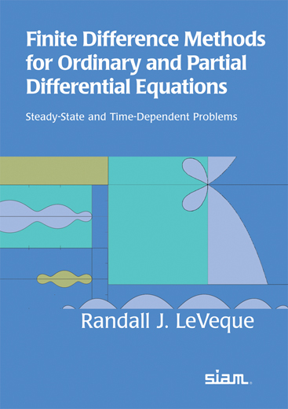
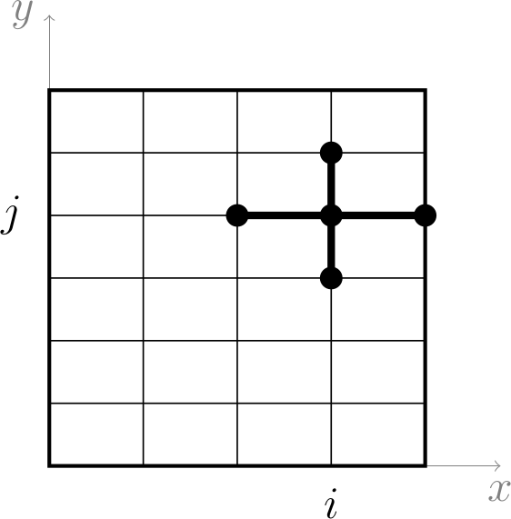
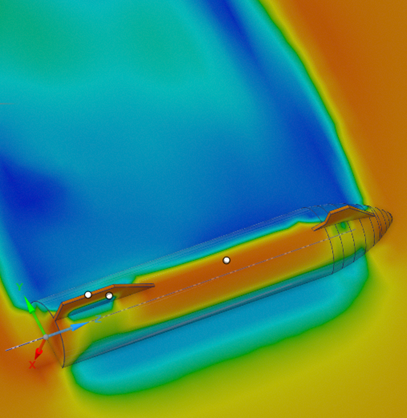

# WARNING: UNDER CONSTRUCTION AND WITH BROKEN LINKS!!

Welcome to the public homepage of **Math F615 Numerical Analysis of Differential Equations**, Spring 2025, in the [Dept. of Mathematics and Statistics](http://www.uaf.edu/dms/) at the [University of Alaska Fairbanks](http://www.uaf.edu/).

#### Instructor:  [Ed Bueler](http://bueler.github.io/)

Email me at [elbueler@alaska.edu](mailto:elbueler@alaska.edu).  I hold [office hours](http://bueler.github.io/OffHrs.htm) in Chapman 306C.

### Canvas course page

Log in to [canvas.alaska.edu/courses/24194](https://canvas.alaska.edu/courses/24194) for the Zoom lecture link, Homework and Exam solutions, and to see your grades.

### Getting Started

* Attend lectures: MWF 3:30--4:30pm in Chapman 107, and synchronously online.

* Read the [Syllabus (PDF)](assets/general/S25/syllabus.pdf).

* See the [Schedule (PDF)](assets/general/S25/schedule.pdf).  Check it often for due dates, and for which topics come next!

* Check out the near-weekly [homework Assignments](homework.html).

* There are two Exams, a Midterm and a Final.  Both are in class, and the Final will happen at the scheduled time.  See the [Exams](exams.html) tab for review guides.

* You will do a Project on a topic of your choice, starting with a Proposal.  Please read the materials on the [Project](project.html) tab before you turn in anything.

* Homework and projects will require some programming in Matlab/Octave or some other suitable scientific computing language.  See the [Computing](computing.html) tab and [_Programming languages compared_ (PDF)](https://bueler.github.io/compareMOP.pdf) for recommended languages.

 &nbsp; &nbsp; &nbsp; &nbsp;  &nbsp; &nbsp; &nbsp; &nbsp; 

* What are we studying?  Check out these Wikipedia pages:

    * [partial differential equations (PDEs)](https://en.wikipedia.org/wiki/Partial_differential_equation)
    * [ordinary differential equations (ODEs)](https://en.wikipedia.org/wiki/Ordinary_differential_equation)
    * [numerical methods for PDEs](https://en.wikipedia.org/wiki/Numerical_methods_for_partial_differential_equations)
    * [numerical methods for ODEs](https://en.wikipedia.org/wiki/Numerical_methods_for_ordinary_differential_equations)
    * [finite difference methods](https://en.wikipedia.org/wiki/Finite_difference_method)
    * [Poisson equation](https://en.wikipedia.org/wiki/Poisson%27s_equation)
    * [diffusion](https://en.wikipedia.org/wiki/Diffusion_equation) and [heat](https://en.wikipedia.org/wiki/Heat_equation) equations
    * [advection equations](https://en.wikipedia.org/wiki/Advection)
    * [stiff differential equations](https://en.wikipedia.org/wiki/Stiff_equation)
    * [explicit versus implicit methods](https://en.wikipedia.org/wiki/Explicit_and_implicit_methods)
    * [Runge-Kutta methods](https://en.wikipedia.org/wiki/Runge%E2%80%93Kutta_methods)
    * [Lax equivalence theorem](https://en.wikipedia.org/wiki/Lax_equivalence_theorem) for finite difference methods

---
_Site design derived from [coordinated Calc I](https://uaf-math251.github.io/), an original [Jekyll](https://jekyllrb.com/) design by [David Maxwell](https://damaxwell.github.io/)._

